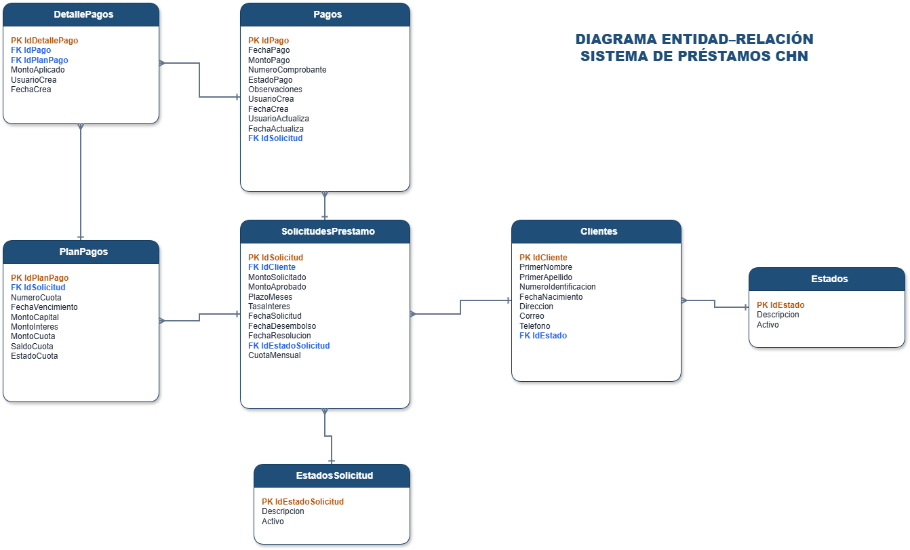

# 🏦 Sistema de Gestión de Préstamos CHN

### Crédito Hipotecario Nacional de Guatemala (CHN)

**Examen Práctico -- Analista Programador** -- Luis Cabrera**

------------------------------------------------------------------------

## 📑 Tabla de Contenido

-   [Descripción](#-descripción)
-   [Funcionalidades](#-funcionalidades)
-   [Tecnologías Utilizadas](#-tecnologías-utilizadas)
-   [Arquitectura](#-arquitectura)
-   [Estructura del Proyecto](#-estructura-del-proyecto)
-   [Base de Datos](#-base-de-datos)
-   [Diagrama Entidad--Relación](#-diagrama-entidadrelación)
-   [API REST](#-api-rest)
-   [Requisitos](#-requisitos)
-   [Configuración](#-configuración)
-   [Instalación](#-instalación)
-   [Acceso](#-acceso)
-   [Autor](#-autor)

------------------------------------------------------------------------

## 📋 Descripción

Sistema web desarrollado en **Java Spring Boot** para administrar
clientes, solicitudes de préstamo, aprobación o rechazo de solicitudes,
generación automática del plan de pagos y registro de pagos.

## 🚀 Funcionalidades

-   Gestión de clientes (CRUD).
-   Gestión de solicitudes de préstamo.
-   Aprobación y rechazo de solicitudes.
-   Generación automática del plan de pagos.
-   Registro de pagos y pagos parciales.
-   Historial de pagos.
-   Actualización automática del saldo pendiente.

## 🛠 Tecnologías Utilizadas

-   Java 17
-   Spring Boot
-   Spring Data JPA
-   Maven
-   SQL Server
-   HTML5
-   CSS3
-   JavaScript

## 🏗 Arquitectura

``` text
Frontend (HTML/CSS/JS)
        │
 REST Controllers
        │
     Services
        │
  Repositories
        │
    SQL Server
```

## 📂 Estructura del Proyecto

``` text
PrestamosCHN
├── database
│   └── script.sql
├── docs
│   ├── Diagrama_ER_Prestamos_CHN.drawio
│   ├── Diagrama_ER_Prestamos_CHN.pdf
│   └── Diagrama_ER_Prestamos_CHN.png
├── src
├── README.md
└── pom.xml
```

## 🗄 Base de Datos

El proyecto utiliza Microsoft SQL Server.

Entidades principales:

-   Clientes
-   Estados
-   EstadosSolicitud
-   SolicitudesPrestamo
-   PlanPagos
-   Pagos
-   DetallePagos

## 📊 Diagrama Entidad--Relación

> Coloca la imagen exportada dentro de la carpeta `docs`.

GitHub la mostrará automáticamente con la siguiente referencia:

``` markdown

```

Vista previa:


También se incluye el archivo editable:

`docs/Diagrama_ER_Prestamos_CHN.drawio`

## 📡 API REST

**Clientes** - GET /clientes - POST /clientes - PUT /clientes/{id} -
DELETE /clientes/{id}

**Solicitudes** - GET /solicitudes - POST /solicitudes - PUT
/solicitudes/{id}/aprobar - PUT /solicitudes/{id}/rechazar

**Plan de Pagos** - GET /planpagos - GET /planpagos/solicitud/{id}

**Pagos** - GET /pagos - POST /pagos

## ⚙ Requisitos

-   Java 17
-   Maven
-   SQL Server
-   Git

## 🔧 Configuración

Editar:

`src/main/resources/application.properties`

## ▶ Instalación

1.  Ejecutar `database/script.sql`
2.  Ejecutar:

``` bash
mvn clean install
mvn spring-boot:run
```

## 🌐 Acceso

-   Backend: http://localhost:8080
-   Frontend: abrir `index.html`

## 👨‍💻 Autor

**Luis Fernando Cabrera López**

Examen Práctico -- CHN
